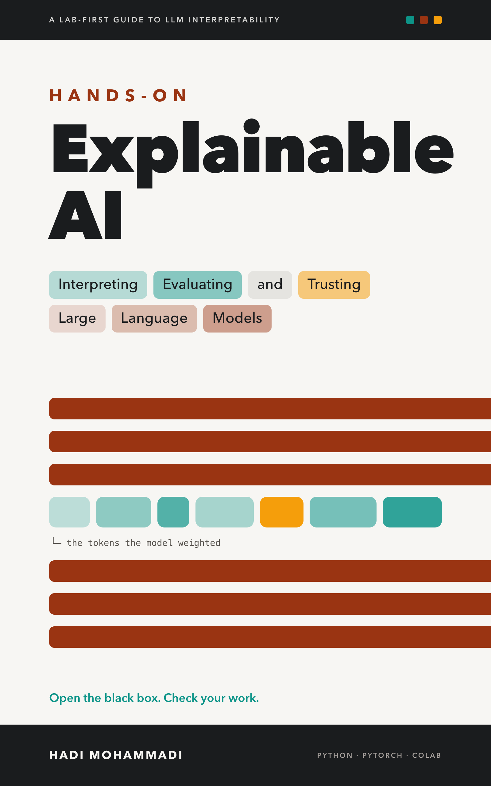

<div align="center">



# Hands-On Explainable AI: Companion Labs

[](https://github.com/mohammadi-hadi/hands-on-xai-labs/actions/workflows/smoke.yml)
[](https://zenodo.org/badge/latestdoi/1323781146)
[](LICENSE)

*Companion labs for Hands-On Explainable AI: 13 executed Colab notebooks on interpreting, evaluating, and trusting LLMs.*

</div>

Companion notebooks for *Hands-On Explainable AI*, a practical guide to opening up language models: feature attribution, attention analysis, probing, chain-of-thought faithfulness, mechanistic interpretability, and explainability in production. Every chapter ships a runnable lab; every number in the book was produced by the notebooks in this repo.

> **Prefer a guided path? Take these labs as a free course.** [Opening the Black Box](https://mohammadi.cv/opening-the-black-box/) is a free, self-paced course built on these notebooks: five days, thirteen labs, with the key result to look for in each. The full instructor-led version runs as a summer school for universities and companies; details at [mohammadi.cv](https://mohammadi.cv). Want a zero-install taste first? [Poke the Black Box](https://mohammadi.cv/playground/) runs in your browser: type a sentence, see which words decide it, and try to flip the verdict.

## Content warning

Chapters 4, 5, 6, and 8 study a hate-speech classifier, and Chapter 10 probes a sentiment model. Their labs load `tweet_eval` (HatEval, SemEval-2019 Task 5, and the sentiment config), publicly distributed research datasets of real tweets. These notebooks display dataset examples verbatim, including slurs, misogyny, and anti-immigrant abuse, in their code cells, saved outputs, and figures. This is a deliberate methodological choice, made in the book and preserved here: sanitizing the text would change what the model sees and make every explanation describe a different input than the one the model classified. The examples appear as data under analysis, not as speech we endorse. All user mentions are anonymized to `@user` by the dataset. Reader discretion is advised when opening the Chapter 4, 5, 6, and 8 notebooks.

## Notebooks

| Ch. | Notebook | Colab | What you build | Requires | Est. free-T4 minutes |
|----:|---|---|---|---|---|
| 1 | `ch01-why-explainability.ipynb` | [](https://colab.research.google.com/github/mohammadi-hadi/hands-on-xai-labs/blob/main/notebooks/ch01-why-explainability.ipynb) | A 30-line "Clever Hans" demo: two 95%-accurate classifiers that collapse to a coin flip under distribution shift, and the one that warned us | core | < 1 |
| 2 | `ch02-map-of-the-territory.ipynb` | [](https://colab.research.google.com/github/mohammadi-hadi/hands-on-xai-labs/blob/main/notebooks/ch02-map-of-the-territory.ipynb) | One sentiment prediction from a fine-tuned transformer, explained five different ways | llm | ~5 |
| 3 | `ch03-inside-the-transformer.ipynb` | [](https://colab.research.google.com/github/mohammadi-hadi/hands-on-xai-labs/blob/main/notebooks/ch03-inside-the-transformer.ipynb) | A guided dissection of GPT-2 small: tokenizers, embedding geometry, attention heads, logit lens, residual norms | llm | 2–3 |
| 4 | `ch04-feature-attribution.ipynb` | [](https://colab.research.google.com/github/mohammadi-hadi/hands-on-xai-labs/blob/main/notebooks/ch04-feature-attribution.ipynb) | A hate-speech classifier that has to show its work: LIME, SHAP, and Integrated Gradients on the same 10 tweets | llm | 5–10 |
| 5 | `ch05-attention.ipynb` | [](https://colab.research.google.com/github/mohammadi-hadi/hands-on-xai-labs/blob/main/notebooks/ch05-attention.ipynb) | Attention maps put on trial: aggregation traps, rollout, IG corroboration, head ablation | llm | ~5 |
| 6 | `ch06-probing-counterfactuals-concepts.ipynb` | [](https://colab.research.google.com/github/mohammadi-hadi/hands-on-xai-labs/blob/main/notebooks/ch06-probing-counterfactuals-concepts.ipynb) | Layer-wise probes, greedy counterfactual edits, and a concept direction: three representation-level explanations | llm | 5–10 |
| 7 | `ch07-build-it-break-it.ipynb` | [](https://colab.research.google.com/github/mohammadi-hadi/hands-on-xai-labs/blob/main/notebooks/ch07-build-it-break-it.ipynb) | A transparent AI-generated-text detector, and then the attack that breaks it | llm | ~5 |
| 8 | `ch08-evaluating-explanations.ipynb` | [](https://colab.research.google.com/github/mohammadi-hadi/hands-on-xai-labs/blob/main/notebooks/ch08-evaluating-explanations.ipynb) | Deletion/insertion faithfulness harness with bootstrap CIs, plus an LLM-judge audit that wipes out | llm | 5–10 |
| 9 | `ch09-cot-faithfulness.ipynb` | [](https://colab.research.google.com/github/mohammadi-hadi/hands-on-xai-labs/blob/main/notebooks/ch09-cot-faithfulness.ipynb) | A faithfulness test bench for chain-of-thought: truncation, mistake injection, planted hints | llm | 5–10 |
| 10 | `ch10-mechanistic-interpretability.ipynb` | [](https://colab.research.google.com/github/mohammadi-hadi/hands-on-xai-labs/blob/main/notebooks/ch10-mechanistic-interpretability.ipynb) | Induction heads, activation patching, SAE features, and steering on GPT-2 small | mechinterp | 6–9 |
| 11 | `ch11-auditing-behavior.ipynb` | [](https://colab.research.google.com/github/mohammadi-hadi/hands-on-xai-labs/blob/main/notebooks/ch11-auditing-behavior.ipynb) | A miniature cultural-alignment audit: 19 WVS moral items scored two ways across three small models | llm | 3–5 |
| 12 | `ch12-training-for-explainability.ipynb` | [](https://colab.research.google.com/github/mohammadi-hadi/hands-on-xai-labs/blob/main/notebooks/ch12-training-for-explainability.ipynb) | A complete SFT-then-DPO preference-training pipeline that trains silent hint-adoption out of a small model | llm | < 5 |
| 13 | `ch13-explainability-in-production.ipynb` | [](https://colab.research.google.com/github/mohammadi-hadi/hands-on-xai-labs/blob/main/notebooks/ch13-explainability-in-production.ipynb) | A fully instrumented RAG assistant: citation audit, retrieval receipts, attribution-drift monitor | llm | 4–8 |

"Requires" names the dependency group each notebook declares in its metadata (`core` = scikit-learn stack only; `llm` = PyTorch/Transformers stack; `mechinterp` = transformer-lens + sae-lens). All labs fit a free-tier Colab T4 in 20 minutes or less; most run in well under 10.

## Quickstart: Colab (zero setup)

Every notebook is standalone. Click its Colab badge in the table above (the same badge sits at the top of each notebook), then choose **Run all** from the **Runtime** menu.

Each notebook's first code cell pins its own installs. To install everything at once instead, upload `requirements-colab.txt` and run one cell:

```
%pip install -q -r requirements-colab.txt
```

Note: `requirements-colab.txt` and the Chapter 1 and 3 install cells pin `numpy==1.26.4`, which is older than Colab's preinstalled NumPy 2.x, so Colab may prompt you to restart the runtime after the install cell. Restart when asked and re-run from the top. This is expected; the other chapters' install cells leave NumPy alone.

## Quickstart: local (uv)

The repo ships `pyproject.toml`, `uv.lock`, `.python-version`, and a small Makefile, so the local environment is managed by [uv](https://docs.astral.sh/uv/) and reproduces the build environment exactly (Python 3.12):

```bash
uv python install 3.12   # once, if needed
make setup               # core only, enough for Chapter 1  (= uv sync)
make setup-ml            # Chapters 2–9, 11–13  (= uv sync --group llm)
make setup-mechinterp    # Chapter 10  (= uv sync --group llm --group mechinterp; uv sync is exact: name both groups)
```

Then run the suite (smoke mode = tiny models and data, minutes not hours):

```bash
make nb-smoke    # fast correctness check
make nb-run      # full mode, the book's actual numbers
```

Notebooks whose dependency group is not installed are skipped, not failed. `VERIFICATION.md` is the book's own T4 checklist: per-notebook wall-time bands and the key numbers a correct run should print.

### Environment switches

| Variable | Effect |
|---|---|
| `BOOK_SMOKE=1` | Smoke mode: tiny models and small data slices; numbers legitimately differ from the book's |
| `BOOK_NB_SAVE=1` | Write executed outputs back into the `.ipynb` files |
| `BOOK_DEVICE` | Force compute device (`cpu`, `mps`, `cuda`); unset = auto-detect |

## Data notes

- **`tweet_eval` (config `hate`)**: HatEval, used in Chapters 4–6 and 8. **Content warning:** this is a hate-speech dataset; tweets contain slurs, misogyny, and anti-immigrant abuse, and the notebooks print examples verbatim so the analysis is honest. Chapter 10 also uses `tweet_eval/sentiment`, which includes profanity.
- **GSM8K** (`main/test`): grade-school math questions for the Chapter 9 chain-of-thought lab. Chapter 12 reuses the battery design but generates its own arithmetic items and downloads nothing.
- **Gemma Scope (optional, Chapter 10)**: one optional cell loads sparse autoencoders for `google/gemma-2-2b`, which is a *gated* model: accept the license on the model page, authenticate with a Hugging Face token (`HF_TOKEN` in Colab), set `RUN_GEMMA = True`, and budget a ~5 GB download. Every required lab uses only ungated models; no token is ever mandatory.
- Notebooks that download datasets also carry small inline fallbacks, so they stay executable offline (with degraded numbers).

## Citing these labs

If these labs feed into academic work, cite the archived release (the concept DOI always resolves to the latest version; GitHub's "Cite this repository" button gives other formats):

```bibtex
@software{mohammadi2026handsonxailabs,
  author = {Mohammadi, Hadi},
  title  = {Hands-On XAI Labs: companion notebooks for Hands-On Explainable AI},
  year   = {2026},
  doi    = {10.5281/zenodo.21804605},
  url    = {https://github.com/mohammadi-hadi/hands-on-xai-labs}
}
```

## About the author

[Hadi Mohammadi](https://mohammadi.cv) ([ORCID 0000-0003-0860-9200](https://orcid.org/0000-0003-0860-9200)) is a PhD candidate in explainable NLP at Utrecht University and a Senior AI & Data Science Expert at AcademicTransfer. These labs are the executable half of his book *Hands-On Explainable AI: Interpreting, Evaluating, and Trusting Large Language Models*; every number the book reports as its own was produced by the notebooks in this repository.

## License

Code in this repository (notebooks, scripts, configuration) is released under the [MIT License](LICENSE), so you can reuse the lab code freely in your own projects, which is the point of a hands-on book.

The book's manuscript text and illustrations are not part of this repository and remain all rights reserved, © 2026 Hadi Mohammadi.
